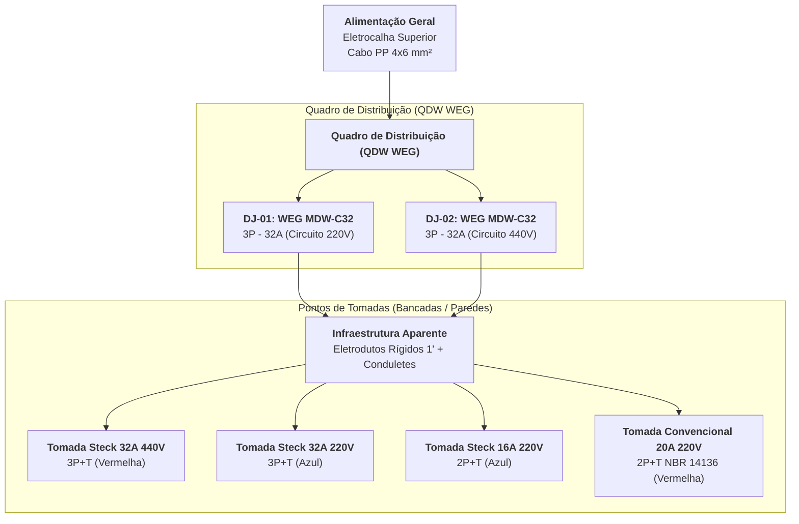
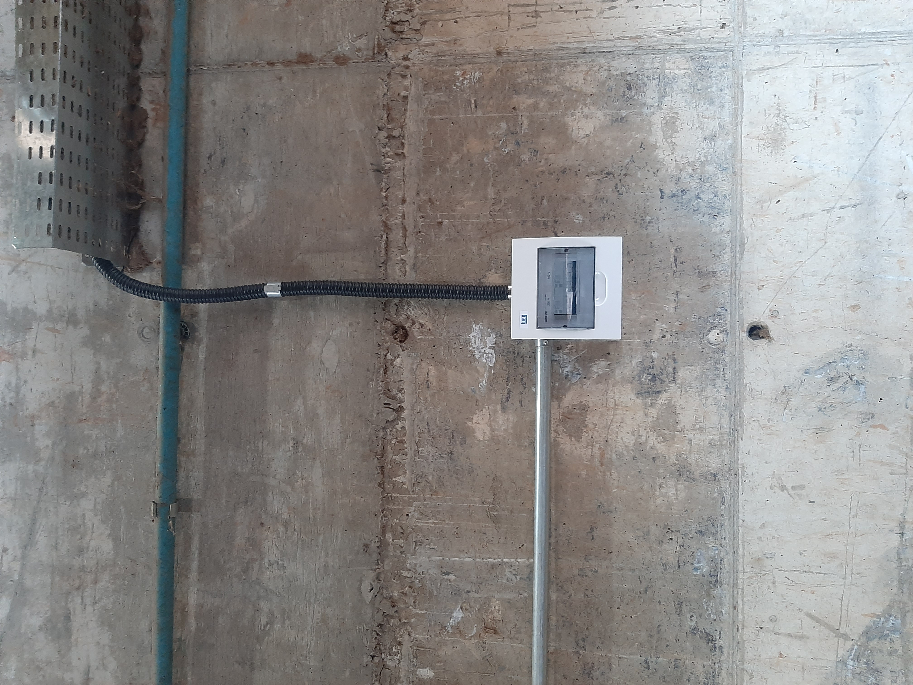
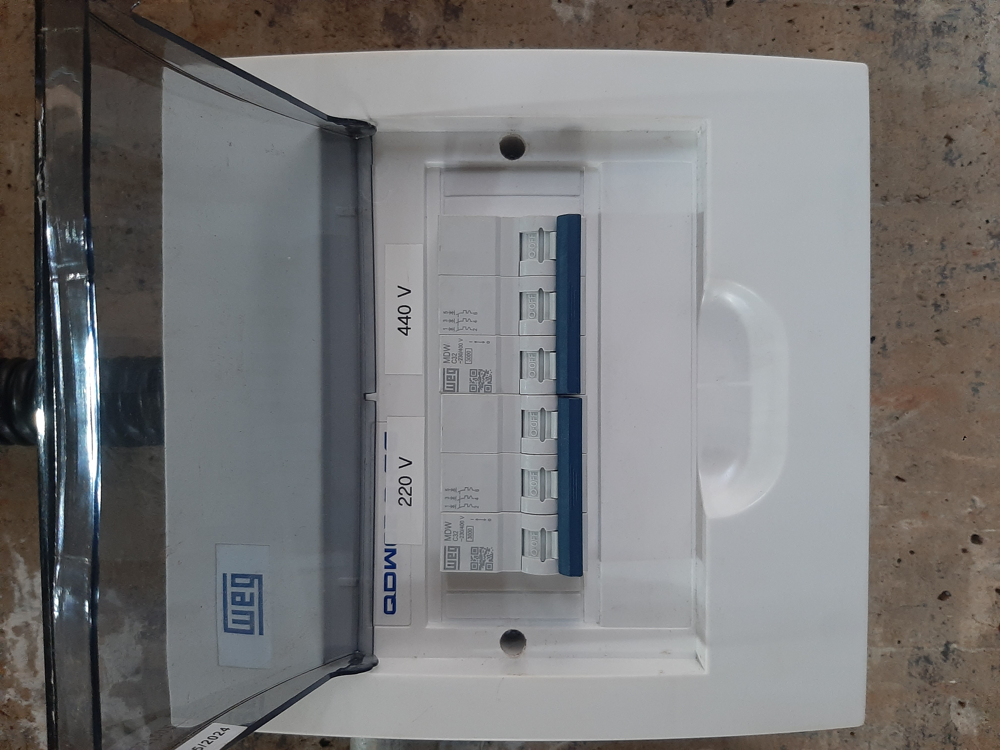
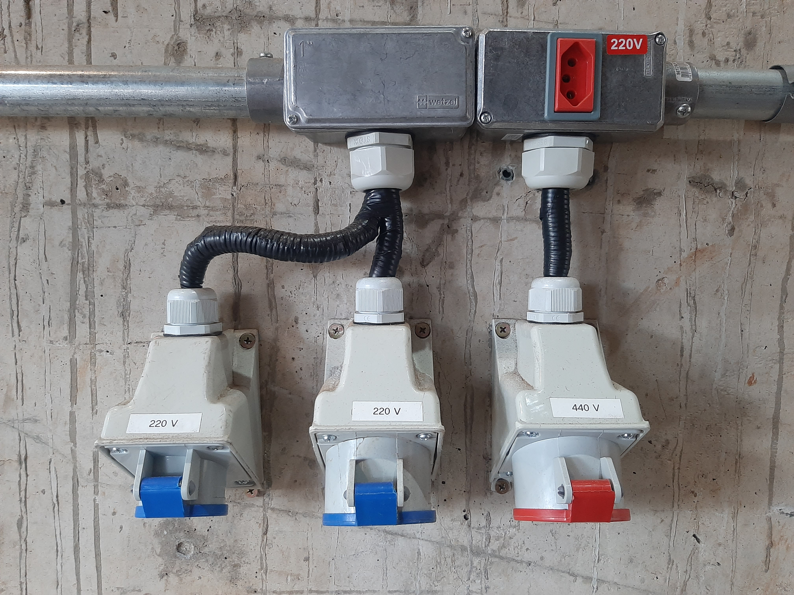
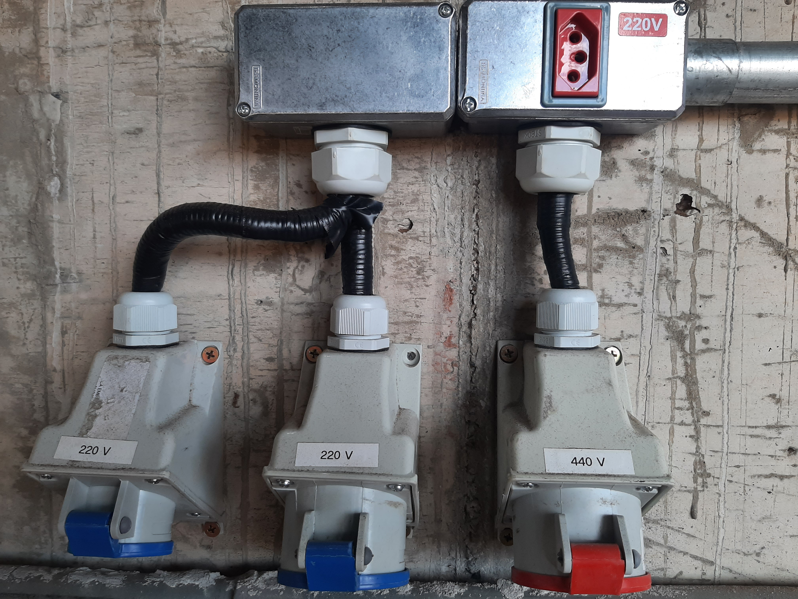
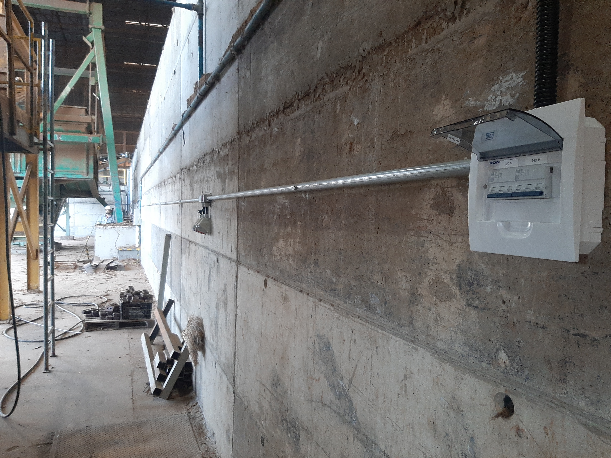
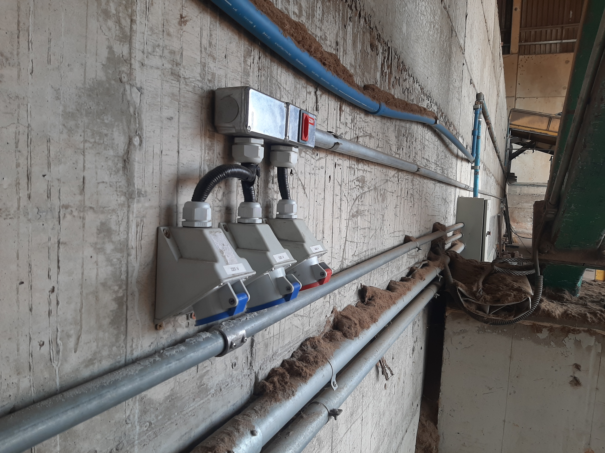
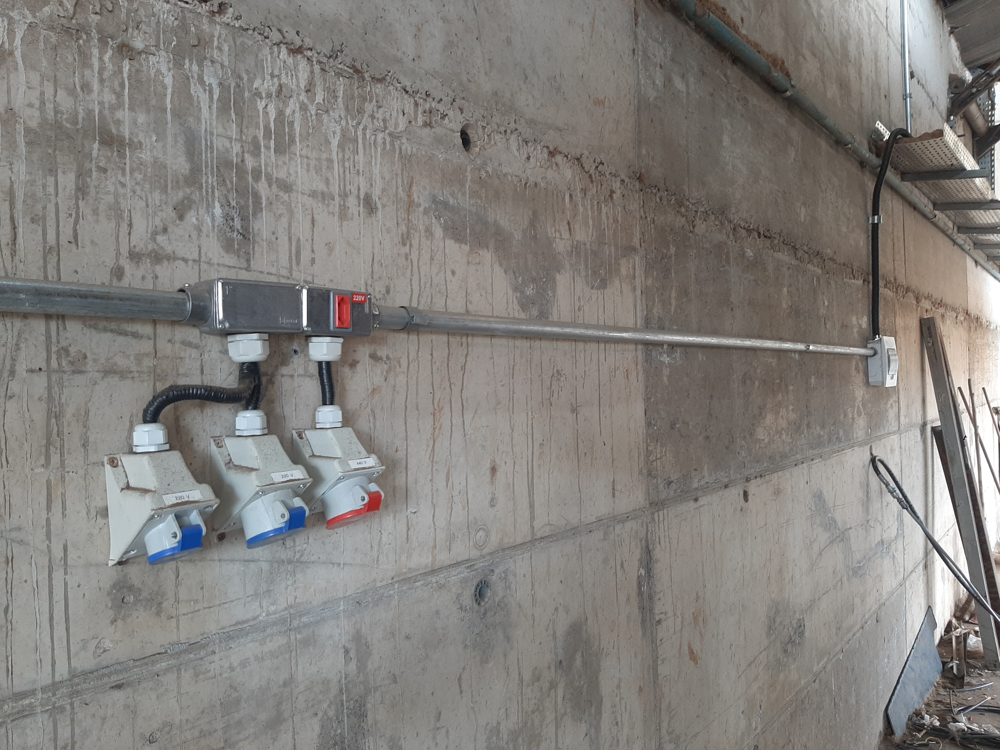

# ⚡ Documentação Técnica: Quadro de Distribuição e Tomadas de Serviço Industriais

Este repositório contém a documentação técnica, especificação de materiais, diagramas elétricos e registro fotográfico "As-Built" da instalação elétrica do Quadro de Distribuição e dos Pontos de Tomada de Serviço Industrial.

---

## 📌 Visão Geral do Projeto

A instalação foi executada para alimentar equipamentos industriais em uma área operacional, disponibilizando pontos de força nas tensões de **220V** e **440V**. A infraestrutura é aparente, composta por tubulação rígida metálica (eletrodutos de 1"), conduletes e prensas-cabos para garantia de vedação mecânica.

---

## 📐 Esquema Unifilar (Diagrama de Distribuição)

O fluxo de distribuição elétrica, partindo da alimentação principal na eletrocalha até os pontos de utilização, está representado no diagrama abaixo:

### Detalhamento dos Circuitos

1. **Alimentação Geral:**
   * **Origem:** Eletrocalha superior.
   * **Condutor:** Cabo PP $4 \times 6\text{ mm}^2$ (~130 metros totais).

2. **Proteção Geral (Quadro QDW WEG):**
   * **Circuito 1 (220V):** Disjuntor WEG MDW C32 (Tripolar $32\text{A}$, Curva C) $\rightarrow$ Alimentação das tomadas de 220V (Trifásica, Bifásica e NBR 14136).
   * **Circuito 2 (440V):** Disjuntor WEG MDW C32 (Tripolar $32\text{A}$, Curva C) $\rightarrow$ Alimentação das tomadas de 440V (Trifásica).

---

## 📊 Tabela Mapeamento de Tomadas e Circuitos

| Identificação | Tensão Nominal | Proteção | Tipo de Tomada | Capacidade | Padrão / Cor |
| :--- | :--- | :--- | :--- | :--- | :--- |
| **Circuito 1 - A** | 220 V Trifásico | WEG MDW-C32 (32A) | Steck Industrial | 32 A | 3P + T (Azul) |
| **Circuito 1 - B** | 220 V Bifásico | WEG MDW-C32 (32A) | Steck Industrial | 16 A | 2P + T (Azul) |
| **Circuito 1 - C** | 220 V Bifásico | WEG MDW-C32 (32A) | Convencional NBR 14136 | 20 A | 2P + T (Módulo Vermelho) |
| **Circuito 2** | 440 V Trifásico | WEG MDW-C32 (32A) | Steck Industrial | 32 A | 3P + T (Vermelha) |

---

## 🛠️ Lista de Materiais (Bill of Materials - BOM)

| Item | Descrição | Quantidade | Aplicação / Observações |
| :-: | :--- | :-: | :--- |
| **01** | Cabo PP Flexível $4 \times 6,0\text{ mm}^2$ | ~130 m | Alimentação e distribuição interna dos circuitos |
| **02** | Quadro de Distribuição Sobrepor WEG QDW | 1 un | Padrão DIN, com tampa fumê |
| **03** | Disjuntor DIN Tripolar WEG MDW-C32 (32A) | 2 un | Proteção dos circuitos 220V e 440V |
| **04** | Eletroduto Rígido Galvanizado 1" | 10 barras (~30m) | Tubulação aparente |
| **05** | Condulete de Alumínio 1" (Tipos C/E/LL/LR) | 4 un | Pontos de derivação e conexão |
| **06** | Tomada Industrial Steck 3P+T 32A 440V | 2 un | Padrão IEC 60309 (Vermelha) |
| **07** | Tomada Industrial Steck 3P+T 32A 220V | 2 un | Padrão IEC 60309 (Azul) |
| **08** | Tomada Industrial Steck 2P+T 16A 220V | 2 un | Padrão IEC 60309 (Azul) |
| **09** | Espelho Condulete 1" c/ Tomada NBR 14136 | 2 un | Módulo Vermelho 20A 220V |
| **10** | Prensa-cabos e Tubo Flexível Espiralado | Diversos | Proteção mecânica e vedação nas entradas |

---

## 🖼️ Galeria de Fotos da Instalação

> **Nota:** Certifique-se de salvar as fotos enviadas dentro da pasta `docs/images/` no seu repositório do GitHub com os nomes indicados abaixo.

### Quadro de Distribuição

| Painel Fechado | Disjuntores Internos (220V / 440V) |
| :---: | :---: |
|  |  |

### Tomadas de Serviço

| Conjunto de Tomadas 1 | Conjunto de Tomadas 2 |
| :---: | :---: |
|  |  |

### Percurso e Infraestrutura

| Vista Geral 1 | Vista Geral 2 | Percurso Tubulação |
| :---: | :---: | :---: |
|  |  |  |

---

## 🛡️ Normas e Segurança Utilizadas

* **NR-10:** Sinalização e identificação clara de todas as tensões de operação ($220\text{V}$ e $440\text{V}$).
* **IEC 60309 / NBR 5410:** Padronização das cores das tomadas industriais (Azul para 220V e Vermelho para 440V).
* **Grau de Proteção (IP):** Utilização de prensa-cabos e tampas protetoras para evitar entrada de poeira e resíduos industriais.
